  

    

  
  
  

 

I break into web apps, mobile apps, APIs, Active Directory, and industrial control systems for a living, then write the report that gets them fixed. Based in Indonesia, working mostly across financial-sector and enterprise engagements.

### Currently

- **Senior Security Consultant** at Vantage Point Security: web, API, and mobile penetration testing, adversary simulation, and Active Directory compromise chains for enterprise and financial-sector clients, backed by custom exploit tooling when off-the-shelf doesn't cut it.
- **Mobile challenge author** for Hack The Box, building production-grade Android reverse-engineering and exploitation challenges.
- Organizer for **Hack The Box Indonesia**; competes internationally with **r3kapig**, **SKSD**, and **PETIR**; occasional speaker and trainer in offensive security.

### Focus

**Offense**: web & API exploitation, Android reverse engineering and dynamic instrumentation, mobile app security (MASVS-aligned), SCADA / OT attack simulation, Active Directory abuse and post-exploitation.

**Research**: binary reverse engineering, custom exploit development, cryptographic analysis, security bypass techniques.

**Toolbox**: Python · Frida · IDA Pro · Ghidra · Burp Suite · Metasploit · BloodHound · Wireshark · Docker

### Certifications

OSCP+ · CREST CRT · CREST CPSA · Burp Suite Certified Practitioner · CXMAP · CAPT

### Elsewhere

[LinkedIn](https://linkedin.com/in/lawbyte) · [Hack The Box](https://app.hackthebox.com/public/users/538189)
